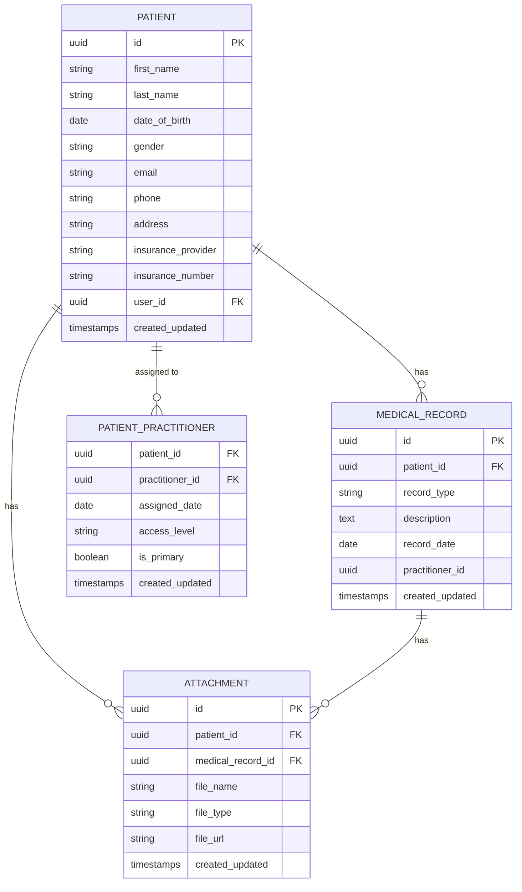

# Patient Service - Entity Relationship Diagram

This diagram illustrates the database schema for the Patient Service.

## Schema Description

### PATIENT
Stores core patient information including personal details, contact information, and insurance data.

### MEDICAL_RECORD
Contains medical history records for patients, linked to the patient who owns the record.

### ATTACHMENT
Manages file attachments such as medical documents, X-rays, or referral letters.

### PATIENT_PRACTITIONER
Junction table that manages the relationships between patients and practitioners.
